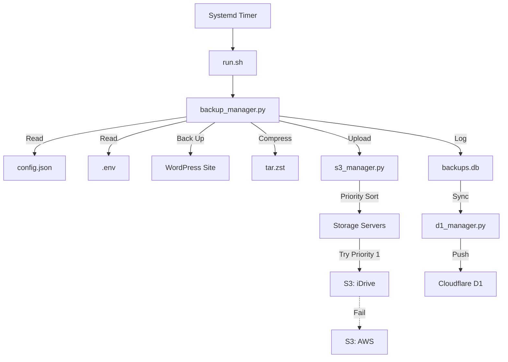

# Architecture

## File Structure

```
/opt/wordpress-backup/
├── .env                # Deployment & Environment settings
├── config.json         # Unified Sites & Storage config
├── backups.db          # SQLite log database
├── deploy.sh           # Deployment script
├── configure.sh        # Setup wizard
├── run.sh              # Entry point
├── sites.json          # (Deprecated) Replaced by config.json
├── lib/
│   ├── backup_manager.py # Core logic
│   ├── s3_manager.py     # S3 interface
│   ├── d1_manager.py     # Cloudflare D1 sync
│   ├── report_manager.py # Email reports
│   └── configure.py      # Wizard logic
└── venv/               # Python environment
```

## Data Flow



## Database Schema (Local SQLite & D1)

### `backup_log`
Tracks execution status of backup jobs.

| Column | Type | Description |
|--------|------|-------------|
| id | INTEGER PK | Logging ID |
| timestamp | DATETIME | Execution time |
| status | TEXT | SUCCESS, ERROR, WARNING |
| details | TEXT | Error message or specific detail |
| site_name | TEXT | Name of the site (from config.json) |
| server_id | TEXT | Origin server ID |

### `s3_archives`
Tracks files uploaded to S3-compatible storage.

| Column | Type | Description |
|--------|------|-------------|
| id | INTEGER PK | Archive ID |
| filename | TEXT | Remote filename |
| storage_name | TEXT | Name of storage provider used |
| s3_endpoint | TEXT | S3 Endpoint URL |
| s3_bucket | TEXT | S3 Bucket Name |
| file_size | INTEGER | Size in bytes |
| server_id | TEXT | Origin server ID |
