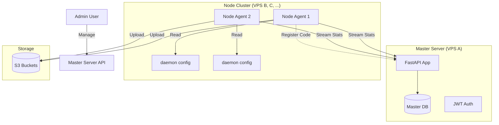

# System Architecture

The platform follows a **Hub-and-Spoke** model with high autonomy for the spokes (Nodes).

## 1. Master Server (The Hub)

*   **Technology**: Python (FastAPI), SQLAlchemy (SQLite/Postgres).
*   **Role**:
    *   **Registry**: Maintains list of active Nodes.
    *   **Gatekeeper**: Handles Node enrollment via Approval Workflow.
    *   **Observer**: Ingests real-time stats (CPU, Disk, Backup Activity) from Nodes.
    *   **API**: Provides endpoints for potential Dashboard UIs.

## 2. Node Agent (The Spoke)

*   **Technology**: `backupd` Daemon (Python).
*   **Role**:
    *   **Executor**: Executes modular backup jobs (e.g., WordPress, MongoDB).
    *   **Reporter**: Pushes heartbeat/stats to Master.
*   **Autonomy**:
    *   **Settings**: Tiered settings (Global > Node > Site) synced from Master.
    *   **Schedule**: Managed internally by daemon scheduler (resilient to master downtime).
    *   **Encryption**: Storage credentials fetched via API and decrypted only in memory.

## 3. Data Flow

### A. Enrollment (Code-Based)
1.  **Node Start**: User runs `python -m daemon.main --mode node`.
2.  **Code Gen**: Node generates and displays a 5-char code (e.g., `XC9D2`).
3.  **Registration**: Admin enters code in Master Dashboard.
4.  **Activation**: Master validates code, sets IP, and activates node.
5.  **Auth**: Node receives persistent `API_KEY` for future requests.

### B. Backup Routine
1.  **Trigger**: Internal scheduler or API request (manual run).
2.  **Job Creation**: Job added to Priority Queue.
3.  **Execution**: `ResourceManager` allocates I/O & Network resources.
4.  **Stages**: Module executes stages (e.g., `backup_db` -> `upload_remote` -> `cleanup`).
5.  **Reporting**: 
    *   Daemon updates job status via `PUT /jobs/{id}`.
    *   Daemon sends `POST /stats` with resource usage.
