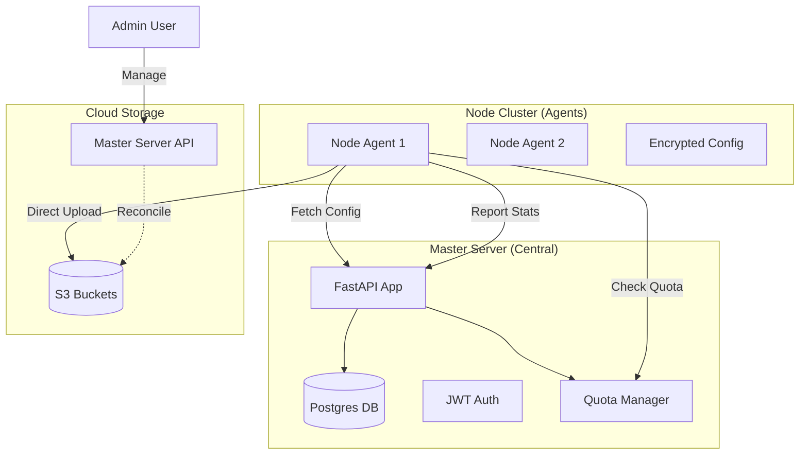

# System Architecture

The platform follows a **Hub-and-Spoke** model with high autonomy for the spokes (Nodes).

## 1. Master Server (The Hub)

*   **Technology**: Python (FastAPI), PostgreSQL (Recommended) or SQLite.
*   **Role**:
    *   **Registry**: Maintains list of active Nodes and Sites.
    *   **Configuration Authority**: Stores and serves encrypted S3 credentials.
    *   **Quota Enforcement**: Tracks usage vs limits. Denies backup permission if over quota.
    *   **Reconciliation**: Periodically scans S3 to ensure database matches reality.
    *   **Observer**: Ingests real-time stats (CPU, Disk).

## 2. Node Agent (The Spoke)

*   **Technology**: `backupd` Daemon (Python) running as Systemd service.
*   **Role**:
    *   **Executor**: Performs Backup & Restore operations.
    *   **Reporter**: Pushes heartbeat/stats to Master.
    *   **Autonomy**: Can run scheduled backups independently (cached credentials), but prefers checking Master for compliance.
*   **Security**:
    *   Never stores S3 keys on disk in plain text.
    *   Decrypts keys in memory only during upload.

## 3. Quota Management System

1.  **Hierarchy**: Node Quota (Hard Limit) > Site Quota (Soft/Hard Limit).
2.  **Enforcement**:
    - **Pre-Flight**: Daemon calls `GET /sites/{id}/quota/check` before starting backup.
    - **Post-Flight**: Master updates usage stats after receiving backup success report.
3.  **Cleanup**:
    - Master calculates expiration dates based on retention policy.
    - S3 objects are deleted via API (`DELETE /backups/{id}`) or Scheduled Cleanup Job on Master.

## 4. Data Flow

### A. Enrollment
1.  **Node Start**: User runs deployment script.
2.  **Join Request**: Node sends hostname/IP to `POST /nodes/join-request`.
3.  **Approval**: Admin approves node in Dashboard.
4.  **Key Exchange**: Node receives persistent `NODE_API_KEY`.

### B. Backup Routine
1.  **Trigger**: Schedule or API.
2.  **Quota Check**: Node asks Master "Can I backup?".
3.  **Config Fetch**: Node pulls Storage Provider details.
4.  **Execute**: Dump -> Compress -> Upload.
5.  **Report**: Node sends metadata to Master.
6.  **Cleanup**: Master deletes old backups from DB and S3 if needed.
