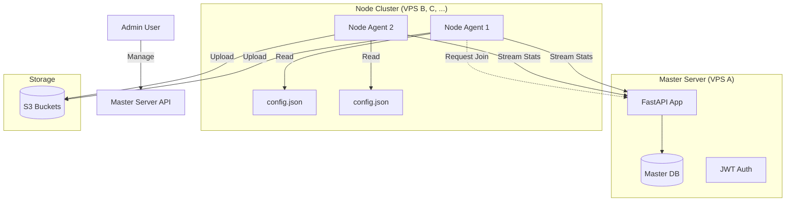

# System Architecture

The platform follows a **Hub-and-Spoke** model with high autonomy for the spokes (Nodes).

## 1. Master Server (The Hub)

*   **Technology**: Python (FastAPI), SQLAlchemy (SQLite/Postgres).
*   **Role**:
    *   **Registry**: Maintains list of active Nodes.
    *   **Gatekeeper**: Handles Node enrollment via Approval Workflow.
    *   **Observer**: Ingests real-time stats (CPU, Disk, Backup Activity) from Nodes.
    *   **API**: Provides endpoints for potential Dashboard UIs.

## 2. Node Agent (The Spoke)

*   **Technology**: Python Scripts (triggered by Systemd).
*   **Role**:
    *   **Executor**: Performs `mysqldump`, file compression (zstd), and S3 uploads.
    *   **Reporter**: Pushes heartbeat/stats to Master.
*   **Autonomy**:
    *   **Site Config**: Defined LOCALLY in `config.json`.
    *   **Schedule**: Managed LOCALLY by Systemd timers.
    *   *Result*: If Master goes offline, Backups **continue to run**.

## 3. Data Flow

### A. Enrollment
1.  **Node Start**: User runs `configure.py`, selects "Managed Node".
2.  **Request**: Node sends `POST /nodes/join-request` (Hostname, IP).
3.  **Pending**: Node enters polling loop, waiting for approval.
4.  **Action**: Admin calls `POST /nodes/approve/{id}` on Master.
5.  **Activation**: Node receives `API_KEY` and saves it.

### B. Backup Routine
1.  **Trigger**: Systemd timer fires `run.sh`.
2.  **Backup**: Agent reads local `config.json`, dumps database, compresses files.
3.  **Upload**: Agent uploads to configured S3 storage (weighted priority).
4.  **Reporting**: 
    *   Agent sends `POST /stats` to Master with CPU/Disk usage and "Active Backups" count.
