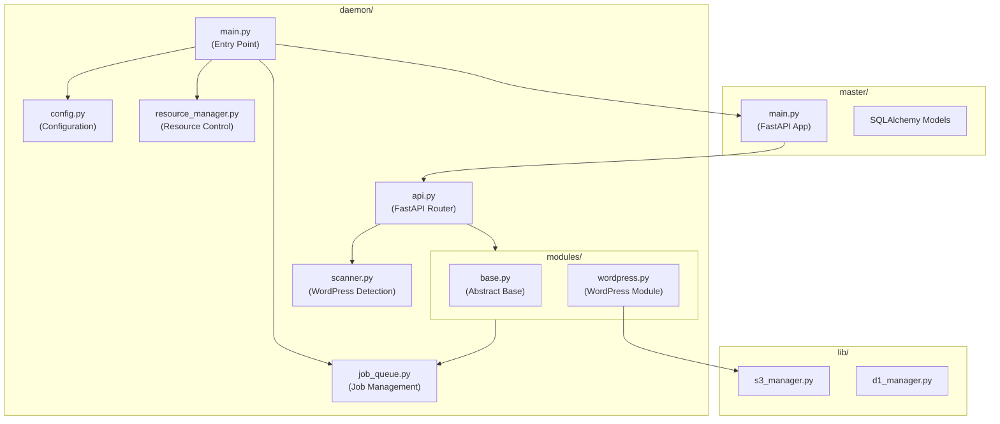
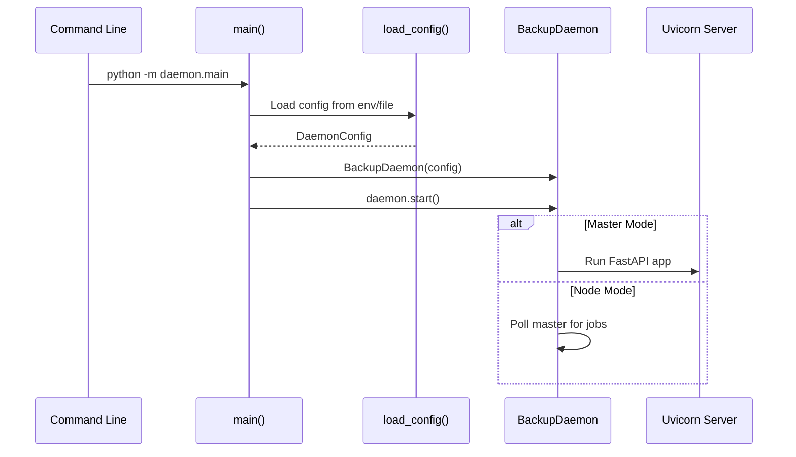
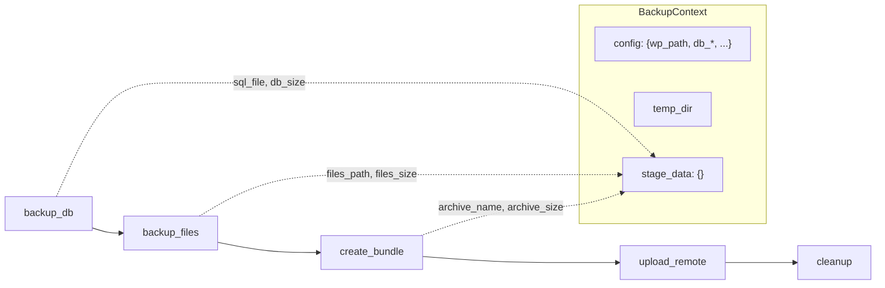
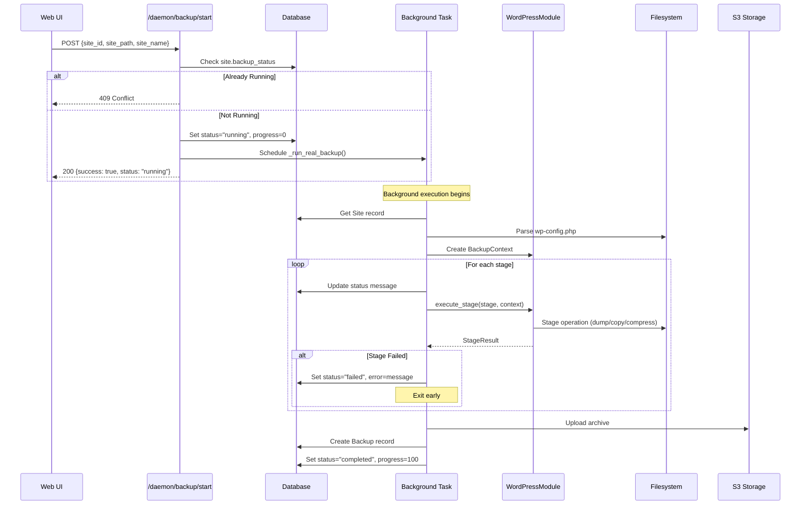

# WordPress Backup Daemon: Deep-Dive Architecture Guide

This document provides a comprehensive breakdown of the daemon component of the WordPress Backup SaaS system. It explains the philosophy, architecture, how parts work together, and the technology involved.

---

## Table of Contents

1. [Philosophy & Design Goals](#philosophy--design-goals)
2. [High-Level Architecture](#high-level-architecture)
3. [Component Breakdown](#component-breakdown)
4. [Data Flow & Request Lifecycle](#data-flow--request-lifecycle)
5. [File-by-File Reference](#file-by-file-reference)
6. [Key Design Patterns](#key-design-patterns)
7. [Technology Stack](#technology-stack)

---

## Philosophy & Design Goals

The daemon was built with these core principles:

### 1. **Master-Node Duality**
A single codebase that can run in two modes:
- **Master Mode**: Runs the full FastAPI server, manages the database, schedules backups, and coordinates nodes
- **Node Mode**: Lightweight agent that executes backup jobs, reports status back to master

> [!NOTE]
> Currently, the system primarily runs in Master mode for single-server deployments. Node mode is designed for future distributed backups across multiple servers.

### 2. **Stage-Based Execution**
Every backup is broken into discrete, trackable **stages**:
```
backup_db → backup_files → create_bundle → upload_remote → cleanup
```

This provides:
- **Visibility**: Know exactly where a backup is at any time
- **Resumability**: (Future) Can resume from a failed stage
- **Progress Tracking**: Percentage completion maps to stage completion

### 3. **Modular Plugin System**
Different backup types (WordPress, MongoDB, etc.) are implemented as **modules** that register themselves. This allows:
- Adding new backup types without changing core code
- Each module defines its own stages and configuration schema
- Runtime discovery of available modules

### 4. **Resource Control**
System resources are managed centrally to prevent:
- Disk I/O saturation (parallel mysqldumps, file copies)
- Network saturation (concurrent uploads)
- CPU overload (parallel compression)

---

## High-Level Architecture



---

## Component Breakdown

### 1. Entry Point: [main.py](file:///home/garikaib/Documents/source/wordpress-backup/daemon/main.py)

**Purpose**: Bootstrap the daemon, detect mode, start services.

**Key Class**: `BackupDaemon`

| Method | Role |
|--------|------|
| `__init__` | Store config, setup shutdown event |
| `start()` | Initialize resources, start in appropriate mode |
| `_run_master()` | Start uvicorn with FastAPI app |
| `_run_node()` | Poll master for jobs (future) |
| `run_job()` | Execute a backup job through stages |
| `shutdown()` | Graceful cleanup |

**Flow**:


---

### 2. Configuration: [config.py](file:///home/garikaib/Documents/source/wordpress-backup/daemon/config.py)

**Purpose**: Environment detection and configuration loading.

**Key Types**:

```python
class DaemonMode(Enum):
    MASTER = "master"
    NODE = "node"
    UNCONFIGURED = "unconfigured"

@dataclass
class DaemonConfig:
    mode: DaemonMode
    master_url: str          # For node mode
    node_api_key: str        # For node mode
    data_dir: str            # Local data storage
    max_io_concurrent: int   # I/O semaphore limit
    max_network_concurrent: int  # Network semaphore limit
    max_upload_bandwidth_mbps: int  # Upload throttling
    api_host: str            # API bind address
    api_port: int            # API port
```

**Detection Order**:
1. `BACKUPD_MODE` environment variable
2. Config file at `BACKUPD_CONFIG` (default: `/etc/backupd/config`)
3. Falls back to `UNCONFIGURED`

---

### 3. API Router: [api.py](file:///home/garikaib/Documents/source/wordpress-backup/daemon/api.py)

**Purpose**: FastAPI endpoints for daemon operations (scanning, backup control).

**Endpoint Groups**:

#### Scan Endpoints
| Endpoint | Method | Purpose |
|----------|--------|---------|
| `/daemon/scan` | GET | Scan filesystem for WordPress sites |
| `/daemon/verify-site` | POST | Verify a specific path is WordPress |

#### Backup Control Endpoints
| Endpoint | Method | Purpose |
|----------|--------|---------|
| `/daemon/backup/start` | POST | Start a real backup (runs in background) |
| `/daemon/backup/stop` | POST | Signal a running backup to stop |
| `/daemon/backup/status/{site_id}` | GET | Get current backup status |
| `/daemon/backup/reset/{site_id}` | POST | Reset stuck backup to idle |
| `/daemon/health` | GET | Health check |

**Key Implementation Pattern** - Background Backup:

```python
@router.post("/backup/start")
async def start_backup(
    request: BackupStartRequest,
    background_tasks: BackgroundTasks,  # FastAPI's background task system
    db: Session = Depends(deps.get_db),
):
    # 1. Validate site exists
    # 2. Check not already running (409 Conflict if so)
    # 3. Update DB status to "running"
    # 4. Schedule background task
    background_tasks.add_task(_run_real_backup, site_id, site_path, site_name)
    # 5. Return immediately
```

The `_run_real_backup` function:
1. Opens its own DB session (background tasks need their own session)
2. Parses `wp-config.php` for database credentials
3. Creates a `BackupContext` with all config
4. Iterates through module stages
5. Updates site status after each stage
6. Creates `Backup` record on success

---

### 4. Job Queue: [job_queue.py](file:///home/garikaib/Documents/source/wordpress-backup/daemon/job_queue.py)

**Purpose**: Manages backup jobs with priority and stage tracking.

> [!NOTE]
> The job queue is primarily used for the module-based job execution flow in `main.py`. The simpler API-driven backups in `api.py` track status directly in the database instead.

**Key Classes**:

```python
class JobStatus(Enum):
    PENDING = "pending"
    RUNNING = "running"
    COMPLETED = "completed"
    FAILED = "failed"
    CANCELLED = "cancelled"

class StageStatus(Enum):
    PENDING = "pending"
    RUNNING = "running"
    COMPLETED = "completed"
    FAILED = "failed"
    SKIPPED = "skipped"

@dataclass
class StageResult:
    status: StageStatus
    message: str
    details: dict
    duration_seconds: float

@dataclass
class BackupJob:
    id: str
    module: str           # "wordpress", "mongodb", etc.
    target_id: int        # site_id
    target_name: str      # human readable
    status: JobStatus
    priority: int         # Higher = more important
    stages: List[str]     # All stage names
    current_stage: str
    stage_results: Dict[str, StageResult]
    progress_percent: int
    # ... timestamps, errors
```

**JobQueue Class**:
- Uses `asyncio.PriorityQueue` for job ordering
- Callbacks for real-time updates (SSE, WebSocket ready)
- Singleton pattern via `get_job_queue()`

---

### 5. Resource Manager: [resource_manager.py](file:///home/garikaib/Documents/source/wordpress-backup/daemon/resource_manager.py)

**Purpose**: Prevent system overload by limiting concurrent operations.

**Key Concept**: Uses `asyncio.Semaphore` for resource gating.

```python
@dataclass
class ResourceLimits:
    max_io_concurrent: int = 2      # Disk operations
    max_network_concurrent: int = 1  # Uploads/downloads
    max_cpu_workers: int = 4        # Thread pool size
    max_upload_bandwidth_mbps: int = 50
```

**Usage Pattern**:

```python
resource_manager = get_resource_manager()

# For disk-heavy operations:
async with resource_manager.acquire_io():
    await backup_database()
    await copy_files()

# For network operations:
async with resource_manager.acquire_network():
    await upload_archive()
```

**Bandwidth Limiting**:
```python
async def rate_limited_upload(self, data: bytes, upload_func):
    """Upload with bandwidth throttling."""
    # Tracks bytes sent per second
    # Sleeps if exceeding limit
```

---

### 6. Scanner: [scanner.py](file:///home/garikaib/Documents/source/wordpress-backup/daemon/scanner.py)

**Purpose**: Discover WordPress installations on the filesystem.

**Detection Strategy**:
1. Scan directories under base path (default: `/var/www`)
2. Check common subdirectories: `htdocs`, `public_html`, `html`, `www`, `.`
3. Look for `wp-content/` directory AND `wp-config.php` file

**Key Functions**:

| Function | Purpose |
|----------|---------|
| `scan_for_wordpress_sites()` | Walk directory tree finding WP sites |
| `parse_wp_config()` | Extract DB credentials from wp-config.php |
| `verify_wordpress_site()` | Deep verification of a specific path |
| `get_site_metadata()` | Query WP database for site URL/name |

**DiscoveredSite Dataclass**:
```python
@dataclass
class DiscoveredSite:
    name: str
    path: str
    has_wp_config: bool
    has_wp_content: bool
    db_name: Optional[str]
    db_user: Optional[str]
    db_host: Optional[str]
    table_prefix: Optional[str]
```

---

### 7. Module System

#### Base Module: [modules/base.py](file:///home/garikaib/Documents/source/wordpress-backup/daemon/modules/base.py)

**Purpose**: Define the contract that all backup modules must implement.

```python
class BackupModule(ABC):
    @property
    @abstractmethod
    def name(self) -> str:
        """Return module name (e.g., 'wordpress')."""
        pass
    
    @abstractmethod
    def get_stages(self) -> List[str]:
        """Return ordered list of stage names."""
        pass
    
    @abstractmethod
    async def execute_stage(self, stage: str, context: BackupContext) -> StageResult:
        """Execute a single backup stage."""
        pass
    
    @abstractmethod
    def get_config_schema(self) -> dict:
        """Return JSON schema for module config."""
        pass
```

**BackupContext** - Shared state between stages:
```python
@dataclass
class BackupContext:
    job_id: str
    target_id: int
    target_name: str
    config: Dict[str, Any]      # wp_path, db_name, db_user, etc.
    temp_dir: Optional[str]      # Working directory
    archive_path: Optional[str]  # Final archive location
    remote_path: Optional[str]   # Cloud storage path
    stage_data: Dict[str, Any]   # Pass data between stages
```

**Module Registry**:
```python
_modules: Dict[str, BackupModule] = {}

def register_module(module: BackupModule):
    _modules[module.name] = module

def get_module(name: str) -> Optional[BackupModule]:
    return _modules.get(name)
```

#### WordPress Module: [modules/wordpress.py](file:///home/garikaib/Documents/source/wordpress-backup/daemon/modules/wordpress.py)

**Stages**:

| Stage | What It Does | Tools Used |
|-------|--------------|------------|
| `backup_db` | Dump MySQL database | `mysqldump` command |
| `backup_files` | Copy wp-content directory | `shutil.copytree()` |
| `create_bundle` | Compress everything | `tar` + `zstd` |
| `upload_remote` | Upload to S3/B2 | (Placeholder - integrates with lib/s3_manager) |
| `cleanup` | Remove temp files | `shutil.rmtree()` |

**Stage Execution Flow**:



---

## Data Flow & Request Lifecycle

### Starting a Backup (Complete Flow)



---

## File-by-File Reference

| File | Lines | Purpose | Key Exports |
|------|-------|---------|-------------|
| [daemon/main.py](file:///home/garikaib/Documents/source/wordpress-backup/daemon/main.py) | 241 | Entry point, daemon class | `BackupDaemon`, `main()` |
| [daemon/config.py](file:///home/garikaib/Documents/source/wordpress-backup/daemon/config.py) | 81 | Configuration loading | `DaemonConfig`, `load_config()` |
| [daemon/api.py](file:///home/garikaib/Documents/source/wordpress-backup/daemon/api.py) | 377 | FastAPI endpoints | `router` |
| [daemon/job_queue.py](file:///home/garikaib/Documents/source/wordpress-backup/daemon/job_queue.py) | 249 | Job management | `JobQueue`, `BackupJob`, `get_job_queue()` |
| [daemon/resource_manager.py](file:///home/garikaib/Documents/source/wordpress-backup/daemon/resource_manager.py) | 123 | Resource limiting | `ResourceManager`, `get_resource_manager()` |
| [daemon/scanner.py](file:///home/garikaib/Documents/source/wordpress-backup/daemon/scanner.py) | 307 | WordPress detection | `scan_for_wordpress_sites()`, `parse_wp_config()` |
| [daemon/modules/base.py](file:///home/garikaib/Documents/source/wordpress-backup/daemon/modules/base.py) | 125 | Module base class | `BackupModule`, `BackupContext`, `register_module()` |
| [daemon/modules/wordpress.py](file:///home/garikaib/Documents/source/wordpress-backup/daemon/modules/wordpress.py) | 282 | WordPress backup | `WordPressModule` (auto-registered) |

---

## Key Design Patterns

### 1. **Singleton Pattern**
Global instances with lazy initialization:
```python
_job_queue: Optional[JobQueue] = None

def get_job_queue() -> JobQueue:
    global _job_queue
    if _job_queue is None:
        _job_queue = JobQueue()
    return _job_queue
```

### 2. **Self-Registration**
Modules register themselves on import:
```python
# At bottom of wordpress.py
register_module(WordPressModule())
```

Main.py imports all modules to trigger registration:
```python
import daemon.modules.wordpress  # noqa
```

### 3. **Context Object**
Pass shared state through stages instead of global variables:
```python
context = BackupContext(job_id=..., target_id=..., config={...})
for stage in stages:
    await module.execute_stage(stage, context)
```

### 4. **Background Tasks with Separate Sessions**
FastAPI's `BackgroundTasks` runs after response is sent. Background functions need their own database sessions:
```python
async def _run_real_backup(site_id: int, ...):
    db = SessionLocal()  # Own session!
    try:
        # ... work ...
    finally:
        db.close()
```

### 5. **Semaphore-Based Resource Control**
Async semaphores limit concurrent operations:
```python
async with resource_manager.acquire_io():
    # Only N concurrent I/O operations allowed
```

---

## Technology Stack

| Layer | Technology | Purpose |
|-------|------------|---------|
| **Web Framework** | FastAPI | Async API server |
| **ASGI Server** | Uvicorn | HTTP server |
| **Database** | SQLAlchemy + SQLite/PostgreSQL | ORM and storage |
| **Background Tasks** | FastAPI BackgroundTasks | Async background jobs |
| **Concurrency** | asyncio | Async/await pattern |
| **Resource Control** | asyncio.Semaphore | Rate limiting |
| **DB Dump** | mysqldump (subprocess) | MySQL database export |
| **File Compression** | tar + zstd (subprocess) | High-ratio compression |
| **Cloud Storage** | boto3 (S3 compatible) | Upload to S3/B2/iDrive |
| **Configuration** | Environment variables + file | Flexible config sources |

---

## Current Limitations & Future Work

> [!WARNING]
> The following features are in development:

1. **Job Resume**: Jobs track stages but can't resume from failure yet
2. **WebSocket Updates**: Callbacks are ready but no WebSocket endpoint exists
3. **Incremental Backups**: Only full backups are currently supported

---

## Roadmap

### Phase 1: Core Stability (Completed)
- [x] Stage-based backup execution
- [x] Database dump via mysqldump
- [x] wp-content file backup
- [x] Zstandard compression
- [x] Background task execution
- [x] Progress tracking in database
- [x] WordPress site scanner
- [x] Resource manager (I/O and network semaphores)

### Phase 2: Storage Integration (Completed)
- [x] Integrate `_upload_remote()` with S3Manager
- [x] Support multiple storage providers per backup
- [x] Implement storage rotation/retention policies (Quota/Reconciliation)
- [x] S3 integration via Master API credentials

### Phase 3: Resilience & Monitoring (In Progress)
- [ ] Job resumption from failed stage
- [ ] Atomic file operations for archive creation
- [ ] Automatic retry with exponential backoff
- [ ] Email notifications for backup failures
- [ ] Webhook notifications (Slack, Discord)
- [ ] Prometheus metrics endpoint

### Phase 4: Distributed Mode (Completed)
- [x] Node registration with Master
- [x] Secure API key distribution
- [x] Job distribution to nodes (via Polling/Schedule)
- [x] Node health monitoring

---

## Quick Reference: Environment Variables

| Variable | Default | Description |
|----------|---------|-------------|
| `BACKUPD_MODE` | auto-detect | `master` or `node` |
| `BACKUPD_MASTER_URL` | - | Master API URL (node mode) |
| `BACKUPD_API_KEY` | - | API key for master (node mode) |
| `BACKUPD_DATA_DIR` | `/var/lib/backupd` | Local data directory |
| `BACKUPD_HOST` | `0.0.0.0` | API bind address |
| `BACKUPD_PORT` | `8000` | API port |
| `BACKUPD_MAX_IO` | `2` | Max concurrent I/O ops |
| `BACKUPD_MAX_NETWORK` | `1` | Max concurrent uploads |
| `BACKUPD_MAX_BANDWIDTH_MBPS` | `50` | Upload speed limit |
