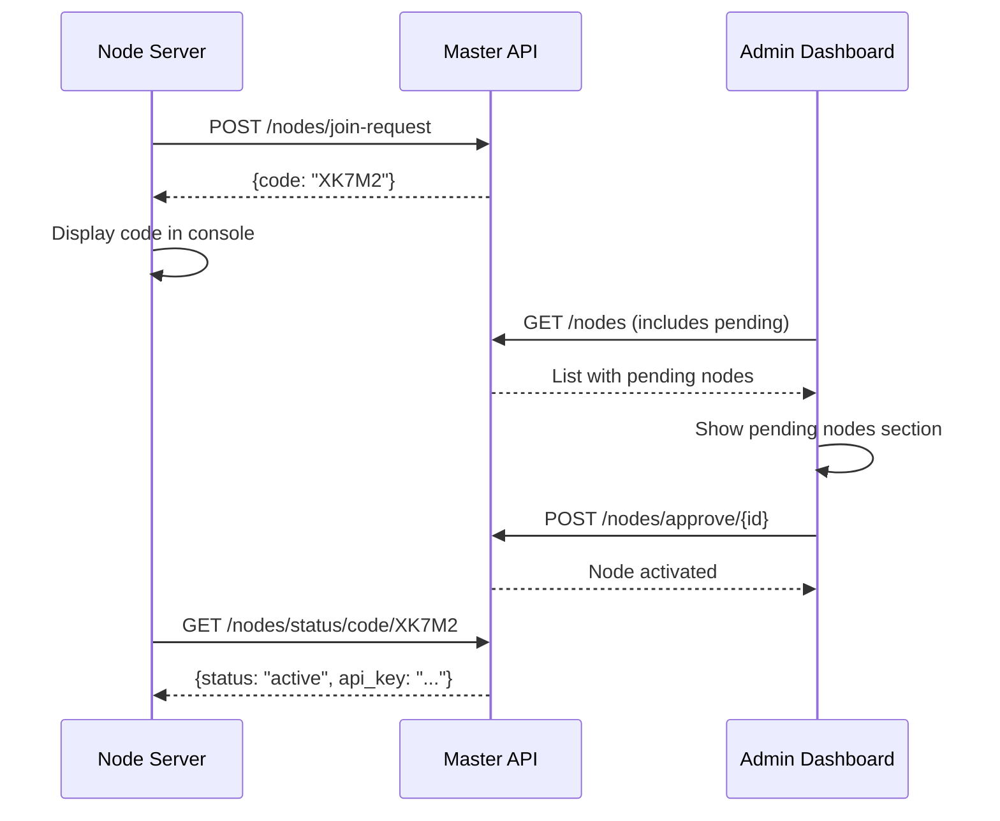

# Node Registration Frontend Brief

## Overview
Allow admins to view pending nodes and approve them using 5-char registration codes.

---

## Flow



---

## Required UI Changes

### Nodes List Page

Add "Pending Nodes" section above active nodes:

```vue
<template>
  <!-- Pending Nodes Section -->
  <div v-if="pendingNodes.length > 0" class="mb-6">
    <h3 class="text-lg font-semibold mb-3">Pending Nodes</h3>
    <div v-for="node in pendingNodes" :key="node.id" 
         class="p-4 border rounded-lg bg-yellow-50">
      <div class="flex justify-between items-center">
        <div>
          <span class="font-medium">{{ node.hostname }}</span>
          <span class="ml-4 text-sm text-gray-500">{{ node.ip_address }}</span>
        </div>
        <div class="flex items-center gap-4">
          <code class="px-2 py-1 bg-gray-100 rounded text-lg font-mono">
            {{ node.registration_code }}
          </code>
          <UButton @click="approveNode(node.id)" color="green">
            Approve
          </UButton>
          <UButton @click="blockNode(node.id)" color="red" variant="outline">
            Block
          </UButton>
        </div>
      </div>
    </div>
  </div>
</template>
```

### Computed Properties

```typescript
const pendingNodes = computed(() => 
  nodes.value.filter(n => n.status === 'pending')
)

const activeNodes = computed(() => 
  nodes.value.filter(n => n.status === 'active')
)
```

### API Calls

```typescript
// Approve node
async function approveNode(nodeId: number) {
  await $fetch(`/api/v1/nodes/approve/${nodeId}`, {
    method: 'POST',
    headers: { Authorization: `Bearer ${token}` }
  })
  await refreshNodes()
}
```

---

## API Endpoints

| Method | Endpoint | Auth | Description |
|--------|----------|------|-------------|
| POST | `/nodes/join-request` | None | Node registers, gets 5-char code |
| GET | `/nodes/status/code/{code}` | None | Node polls for approval |
| POST | `/nodes/approve/{id}` | Admin | Approve pending node |
| GET | `/nodes/` | User | List all nodes (includes pending) |

---

## NodeResponse Schema Update

Ensure frontend types include:

```typescript
interface Node {
  id: number
  hostname: string
  ip_address: string | null
  status: 'pending' | 'active' | 'blocked' | 'inactive'
  registration_code: string | null  // Only present when pending
  storage_quota_gb: number
  // ...
}
```
