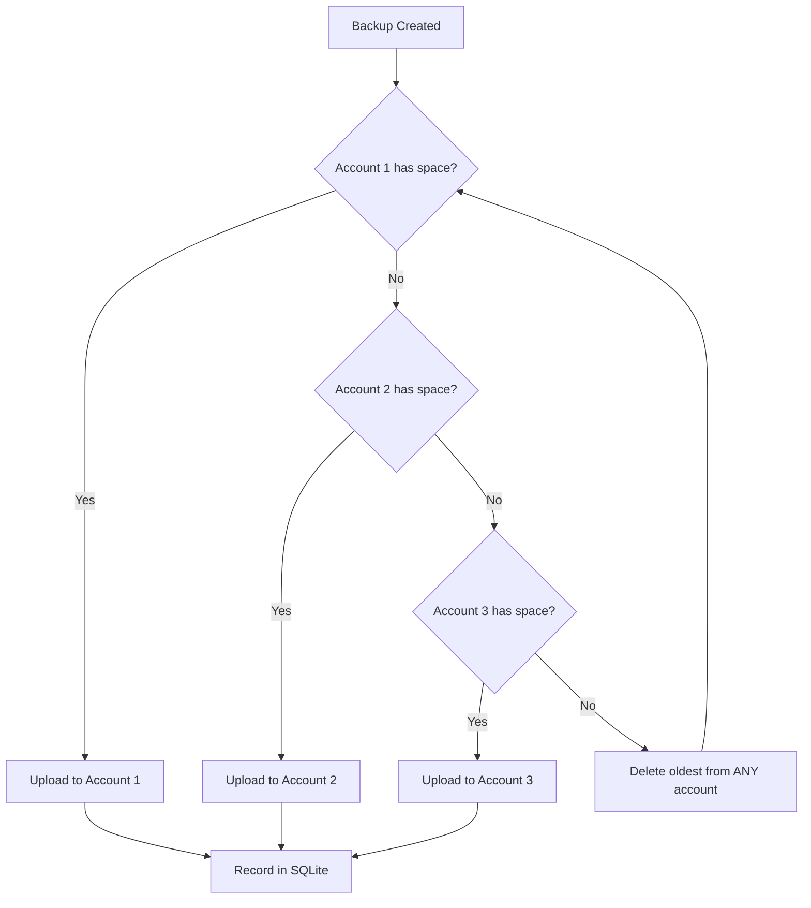

# WordPress Backup System - Walkthrough

## Summary

Successfully converted the MongoDB sync-backup system into a comprehensive WordPress backup solution for **zimpricecheck.com**.

---

## Key Changes Made

### Files Modified

| File | Description |
|------|-------------|
| [backup_manager.py](backup_manager.py) | Complete rewrite for WordPress backups |
| [configure.py](configure.py) | Updated wizard with WordPress-specific settings |
| [report_manager.py](report_manager.py) | Enhanced reporting with archive details |
| [deploy.sh](deploy.sh) | Updated for new server (port 2200) |
| [run.sh](run.sh) | Updated messaging |
| [.env](.env) | WordPress-specific configuration |
| [README.md](README.md) | Complete documentation |
| [requirements.txt](requirements.txt) | Added mega.py library |

### Files Created

| File | Description |
|------|-------------|
| [wordpress-backup.service](wordpress-backup.service) | Systemd service for backups |
| [wordpress-backup.timer](wordpress-backup.timer) | Timer for midnight backup |
| [wordpress-report.service](wordpress-report.service) | Systemd service for reports |
| [wordpress-report.timer](wordpress-report.timer) | Timer for 08:00 AM report |

### Files Removed

- `mongodb-backup.service`
- `mongodb-backup.timer`
- `=8.2.0` (artifact from previous installation)

---

## Feature Highlights

### 1. Multi-Mega Account Support



- **Up to 3 Mega accounts** supported
- Each account has **19.5 GB usable** (20GB - 500MB overhead)
- Archives are **never split** across accounts
- Oldest archive across **all accounts** is deleted first when all are full

### 2. Mega Storage Account

> [!IMPORTANT]
> **Primary Mega Account**: `garikai@zimpricecheck.com`
> 
> This account stores all WordPress backups. Additional accounts can be added via the `.env` file.

### 3. Backup Contents

Each archive (`wp-backup-YYYYMMDD-HHMMSS.tar.zst`) contains:

| File | Source |
|------|--------|
| `database.sql` | MariaDB dump with `--add-drop-table` |
| `wp-config.php` | `/var/www/zimpricecheck.com/wp-config.php` |
| `wp-content.tar` | `/var/www/zimpricecheck.com/htdocs/wp-content` |

### 4. Scheduling

| Schedule | Description |
|----------|-------------|
| **Backup** | Daily at midnight (Africa/Harare, UTC+2) |
| **Report** | Daily at 08:00 AM (Africa/Harare) |

Configurable frequencies: `daily`, `twice`, `every-6h`, `every-2h`

### 5. Email Notifications

- **Daily Summary**: Sent once per day with all backup details
- **Failure Alerts**: Sent immediately when backup fails
- When backups run more than 2x/day, only one summary email is sent

---

## Remote Server Configuration

| Setting | Value |
|---------|-------|
| Host | `ubuntu@wp.zimpricecheck.com` |
| SSH Port | `2200` |
| Install Path | `/opt/wordpress-backup` |
| Temp Directory | `/var/tmp/wp-backup-work` (outside WordPress!) |

---

## Deployment

To deploy the backup system:

```bash
cd /home/garikaib/Documents/source/wordpress-backup
./deploy.sh
```

This will:
1. Bundle all files (excluding venv, git, backups)
2. Upload to `wp.zimpricecheck.com:2200`
3. Install to `/opt/wordpress-backup`
4. Set up Python virtual environment
5. Install systemd timers

---

## Manual Backup

After deployment, run manually on the server:

```bash
ssh -p 2200 ubuntu@wp.zimpricecheck.com 'cd /opt/wordpress-backup && sudo ./run.sh'
```

Dry-run (test without creating backup):

```bash
ssh -p 2200 ubuntu@wp.zimpricecheck.com 'cd /opt/wordpress-backup && sudo ./run.sh --dry-run'
```

---

## Verification Results

| Test | Result |
|------|--------|
| Python syntax check | ✅ Passed |
| All files created | ✅ Complete |
| Systemd files generated | ✅ Ready |
| MongoDB references removed | ✅ Clean |

---

## Next Steps

1. **Deploy to server**: Run `./deploy.sh`
2. **Verify installation**: Check timer status on remote
3. **Test backup**: Run manual backup once to verify
4. **Optional**: Add additional Mega accounts in `.env`
